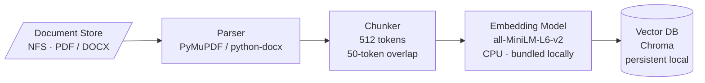
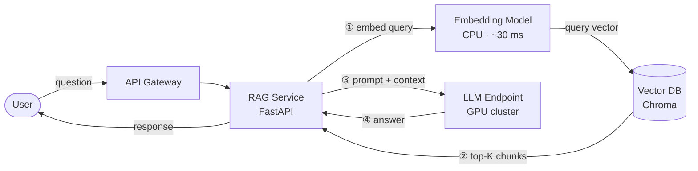

# Q Team Take-Home — Leon Ye

Three-part submission: system design (Part A), working implementation (Part B), and written investigation (Part C).

| Part | Summary |
|---|---|
| **[Part A](#part-a--system-design-on-prem-rag-for-internal-documents)** | On-prem RAG system for 2,000 internal documents, 20 concurrent users, no internet access |
| **[Part B](#part-b--llm-evaluation-harness)** | Lightweight CLI harness — runs JSONL test cases against an LLM endpoint, scores and reports results |
| **[Part C](#part-c--investigation-outdated-or-irrelevant-answers)** | Three specific things to investigate when answers go stale six months post-deployment |

---

# Part A — System Design: On-Prem RAG for Internal Documents

> **Constraints:** on-prem only · no internet at serving layer · GPU cluster shared across departments · ~2,000 docs, monthly refresh · 20 concurrent users · "snappy" = p95 ≤ 3 s · small generalist team, no dedicated DevOps

## Architecture

The system is a RAG pipeline split into two paths: an offline batch ingestion path and an online query path.

### Offline — monthly batch ingestion



### Online — per-query path



**Components:**

- **Document store** — shared network file system (NFS/SMB). No cloud storage; all data stays on-prem.
- **Parser** — extracts plain text from PDF/DOCX (PyMuPDF / python-docx). CPU, runs in the batch job.
- **Chunker** — 512-token fixed chunks, 50-token overlap. Preserves document ID and page number as metadata.
- **Embedding model** — `all-MiniLM-L6-v2` bundled and cached locally. No external calls; no internet required. Runs on CPU; GPU not needed at this scale.
- **Vector DB** — Chroma as a persistent local server. Stores embeddings plus metadata (source doc, page, `indexed_at` timestamp).
- **RAG service** — FastAPI service handling the online path: embed → retrieve → build prompt → call LLM → return.
- **LLM endpoint** — existing GPU-cluster endpoint behind the API gateway. Not owned by this team.
- **Query cache** — in-memory LRU cache keyed on query hash. Effective for FAQ-style repeated questions across departments.

## Key Decisions and Tradeoffs

**Fixed-size chunking vs. semantic chunking** — Fixed chunks (512 tokens, 50 overlap) are simple, fast, and predictable. Semantic chunking produces better retrieval quality but requires per-format heuristics and more ingestion complexity. For a monthly batch on a small team, simplicity wins for v1. The overlap mitigates split-sentence boundary failures.

**Chroma vs. Weaviate / Qdrant / pgvector** — Chroma deploys as a single process, needs minimal ops, and supports persistent local storage. Weaviate and Qdrant offer richer filtering and horizontal scale — unnecessary at 2,000 docs and 20 users. pgvector is viable if the team already runs PostgreSQL. For a team with no dedicated DevOps, Chroma's operational simplicity is the deciding factor.

**CPU embedding vs. GPU embedding** — Embedding a 512-token query takes ~30–50 ms on a modern CPU. For 20 concurrent users this sits well inside the 3 s budget. Reserving GPU for the LLM avoids scheduling contention on the shared cluster. GPU embedding only matters above ~10× current query volume.

**No fine-tuning** — Fine-tuning improves factual grounding but requires GPU time, versioned training data, and a promotion pipeline. RAG achieves the same grounding with faster iteration: update the doc store, re-run ingestion. Fine-tuning becomes appropriate when the domain vocabulary is highly specialised and retrieval alone cannot close the gap.

**No real-time indexing** — A real-time pipeline (Kafka → index on upload) adds significant infrastructure complexity for marginal benefit when documents only change monthly. A scheduled batch job is sufficient.

**No per-department ACL in v1** — Access control requires user identity propagation into the retrieval layer. If departments need isolation, the simplest path is separate Chroma collections per department, filtered at query time by a `department_id` field in the API request.

## What I Would Monitor Post-Deployment

| Signal | Why | How |
|---|---|---|
| **Query latency p50 / p95 / p99** | Core SLA. Split by stage (embed / retrieve / LLM) to localise degradation. | Prometheus histogram on the RAG service |
| **LLM endpoint error and timeout rate** | The shared GPU endpoint is the highest-risk dependency. Timeouts cascade to users. | HTTP client metrics + alerting |
| **Retrieval top-1 cosine score** | Low similarity means the query is out-of-distribution for the current index. | Log per query; alert if median drops below threshold |
| **Vector DB index size** | Catches runaway re-ingestion (duplicate chunks) and confirms ingestion health. | Chroma collection count metric |
| **Batch ingestion job success / duration** | Silent failures leave users querying stale data with no error signal. | Exit code + duration logged to a simple dashboard |
| **User feedback (thumbs up / down)** | The only ground-truth signal for answer quality. Even a binary rating surfaces failures invisible to latency metrics. | In-app button → append to a log file |

## One Failure Mode That Would Only Surface in Production

**Stale embeddings from a partial re-ingestion run.**

During the monthly batch job, chunks are re-embedded and upserted incrementally — unchanged documents are left in place, updated documents are rewritten. If the job exits halfway (OOM, disk full, timeout), the index is left in a mixed state: some documents at revision N+1, others still at revision N.

A query that spans multiple documents now retrieves chunks from different revision states, leading to contradictory answers. The LLM synthesises a confident response from inconsistent context, and neither the user nor the system surfaces an error.

This does not appear in development because fixture datasets always run to completion. In production, large corpora and resource pressure make partial runs likely.

**Mitigation:** Treat each ingestion run as an atomic swap — write new chunks to a staging collection, validate chunk count and score distribution against the prior collection, then atomically alias the collection pointer. Expose the current collection version on a health endpoint so monitoring can detect a failed cutover.

---

# Part B — LLM Evaluation Harness

A lightweight CLI tool that runs structured JSONL test cases against an LLM endpoint, scores each response, and produces a structured summary with pass rate, failures, and anomaly detection.

## Project layout

```
.
├── harness/
│   ├── main.py           # CLI entry point (argparse)
│   ├── loader.py         # JSONL loader and validation
│   ├── runner.py         # Runs cases against the endpoint; RunSummary dataclass
│   ├── scorer.py         # exact_match and keyword_overlap scorers
│   └── mock_endpoint.py  # Built-in mock (random / fixed / echo modes)
├── tests/
│   ├── test_loader.py    # Loader unit tests
│   ├── test_runner.py    # Scorer, runner, format_summary tests
│   └── test_eval_runner.py  # Acceptance tests for the eval pipeline
├── data/
│   └── test_cases.jsonl  # Five-question HR policy suite
├── sample_data/          # Ready-to-run JSONL files for manual testing
├── outputs/              # Committed evaluation run outputs
├── fixtures/             # Pytest fixture JSONL files (bad JSON, missing fields)
├── pyproject.toml
└── requirements.txt
```

## Setup

```bash
# 1. Create and activate a virtual environment
python3 -m venv .venv
source .venv/bin/activate        # Windows: .venv\Scripts\activate

# 2. Install the package and dev dependencies
pip install -e ".[dev]"

# 3. Verify everything works
pytest tests/ -v                 # expect: 43 passed
harness --help                   # confirm the CLI is on your PATH
```

Requires Python 3.11+. No external API key needed — the mock endpoint is built in.

## End-to-end walkthrough

**Step 1 — Run the harness against the included test suite:**

```bash
harness data/test_cases.jsonl
```

**Step 2 — Save full JSON results:**

```bash
harness data/test_cases.jsonl --output outputs/my_run.json
```

**Step 3 — Try different modes and scorers:**

```bash
# Fixed response mode — every case gets the same mock answer
harness data/test_cases.jsonl --mode fixed

# Exact-match scoring — stricter than the default keyword overlap
harness data/test_cases.jsonl --mode fixed --scorer exact_match

# Simulate 20% endpoint failure rate
harness data/test_cases.jsonl --fail-rate 0.2 --log-level DEBUG

# Reproducible run (same seed = same random responses every time)
harness data/test_cases.jsonl --mode random --seed 42
```

**Step 4 — Run the unit tests:**

```bash
pytest tests/ -v
```

A committed sample run is at [`outputs/sample_run.json`](outputs/sample_run.json) and the full CI test log is at [`.test-evidence/TW-11/run-1.log`](.test-evidence/TW-11/run-1.log).

## All CLI flags

| Flag | Default | Description |
|---|---|---|
| `test_file` | *(required)* | Path to a `.jsonl` test file |
| `--scorer` | `keyword_overlap` | `keyword_overlap` or `exact_match` |
| `--mode` | `random` | Mock response mode: `random`, `fixed`, or `echo` |
| `--seed` | `None` | RNG seed — makes random runs reproducible |
| `--fail-rate` | `0.0` | Probability `[0–1]` that a call raises a simulated error |
| `--output` | `None` | Write full JSON results to this path |
| `--log-level` | `WARNING` | `DEBUG`, `INFO`, `WARNING`, or `ERROR` |

## How to read the output

```
============================================================
EVAL SUMMARY  total=5  passed=1  failed=4  errors=0  pass_rate=20.0%
============================================================

FAILURES / ERRORS:
  [q2] score=0.0000  score 0.00 < threshold 0.50; missing tokens: ['direct', 'manager']
           input:    'Who approves travel claims?'
           expected: 'Direct manager'
           got:      'Medical certificates must be submitted within 3 working days'

ANOMALIES:
  all responses identical ('14 days annual leave') — endpoint may be returning a fixed stub
```

| Field | Meaning |
|---|---|
| `errors` | Endpoint threw an exception — the case was not scored |
| `failed` | Endpoint responded but scored below the pass threshold |
| `score=0.00 < threshold 0.50` | Jaccard overlap of token sets: 0 = no shared words, 1 = identical |
| `missing tokens` | Words in the expected answer absent from the response |
| `ANOMALIES` | Auto-detected: all-errors (endpoint down?), all-identical responses (stuck stub?) |

Exit codes: `0` = all passed · `1` = at least one failure or error · `2` = bad input file.

## How to add custom evaluation

**Custom test cases (no code required)** — create any `.jsonl` file:

```jsonl
{"id": "q1", "input": "What is the leave policy?", "expected": "14 days annual leave"}
{"id": "q2", "input": "Who approves travel claims?", "expected": "Direct manager"}
```

```bash
harness my_cases.jsonl
```

**Custom endpoint** — call `run_evaluation()` directly from your own script:

```python
import requests
from harness.loader import load_test_cases
from harness.runner import run_evaluation, format_summary

def my_endpoint(prompt: str) -> str:
    resp = requests.post("http://your-llm-host/v1/chat", json={"prompt": prompt}, timeout=30)
    resp.raise_for_status()
    return resp.json()["response"]

cases = load_test_cases("my_cases.jsonl")
summary = run_evaluation(cases, endpoint=my_endpoint)
print(format_summary(summary))
```

**Custom scorer** — implement `(response: str, expected: str) -> Score`:

```python
from harness.scorer import Score
from harness.runner import run_evaluation

def semantic_match(response: str, expected: str) -> Score:
    score = my_embedding_similarity(response, expected)  # e.g. sentence-transformers
    passed = score >= 0.7
    return Score(passed=passed, method="semantic", score=score,
                 reason="ok" if passed else f"similarity {score:.2f} < 0.70")

summary = run_evaluation(cases, endpoint=my_endpoint, scorer=semantic_match)
```

## How scoring works

Two built-in scorers, both normalise text (lowercase, collapsed whitespace) before comparing.

**`keyword_overlap`** (default) — Jaccard similarity on token sets:

Each line in a JSONL file is one test case:

```json
{"id": "q1", "input": "What is the leave policy?", "expected": "14 days annual leave"}
```
score = |tokens(response) ∩ tokens(expected)| / |tokens(response) ∪ tokens(expected)|
```

Passes when `score ≥ 0.5`. Good for policy answers where paraphrase is acceptable but key terms (numbers, names, IDs) must appear.

**`exact_match`** — case-insensitive, whitespace-normalised string equality. Score is `1.0` (pass) or `0.0` (fail). Use when the expected answer is a short canonical phrase.

## How errors are handled

- **Malformed JSONL** — loader raises `ValueError` with the line number and field name before any cases run. CLI exits with code `2`.
- **Missing file** — `FileNotFoundError` raised immediately. Same exit path.
- **Endpoint error** — any exception during a call is caught, recorded as `error=<message>`, and the remaining cases continue. The run is never aborted mid-flight.
- **Anomaly detection** — post-run flags: all-cases-errored and all-responses-identical.

## What I'd add with more time

- **Semantic scoring** via sentence embeddings (cosine similarity) — penalises wrong answers, not correct paraphrases
- **Async runner** to parallelise requests for large test suites
- **CI integration** to gate deployments on a minimum pass-rate threshold
- **HTML report** as an alternative to the JSON output
- **Retry logic** with exponential backoff for transient endpoint errors

---

# Part C — Investigation: Outdated or Irrelevant Answers

**Scenario:** Six months post-deployment, users report answers that are outdated or irrelevant even though source documents are correct and up to date.

## 1. Index staleness — reconciliation query

The most likely cause is the vector index lagging behind the monthly document refresh. I would run a reconciliation pass: compare each document's `last_modified` timestamp on the file system against the `indexed_at` field stored in chunk metadata at ingestion time. Any document where `indexed_at < last_modified` has stale embeddings. I would then inspect the batch job logs for the last three runs to confirm the job completed — a silent partial exit due to OOM or disk pressure is the most common culprit at this scale, and it leaves the index in a mixed-revision state with no visible error to the user.

## 2. Retrieval quality drift — Recall@k on a golden set

A shift in retrieval quality produces plausible-sounding but wrong answers even when the index is current. I would build a golden set of 20–30 query/passage pairs from known-correct answers at deployment time, then compute Recall@5 and NDCG@5 on the current index and compare against the baseline. If the metric dropped, I would check whether the embedding model binary or tokeniser changed since deployment — even a minor library upgrade can shift the embedding space enough to degrade retrieval without triggering any error.

## 3. Chunking or metadata filter mismatch — BM25 comparison

Relevant content may exist in the index but fail to surface due to chunk boundary errors or an overly restrictive metadata filter. I would run BM25 (via `rank-bm25`, no external dependencies) over the raw document text for the failing queries, then compare which passages rank highly against what the dense retriever returns. Passages that score well under BM25 but are absent from dense retrieval point to a chunking or embedding mismatch. I would also audit any department or date-range metadata filters applied at query time to confirm they are not inadvertently excluding valid documents.
