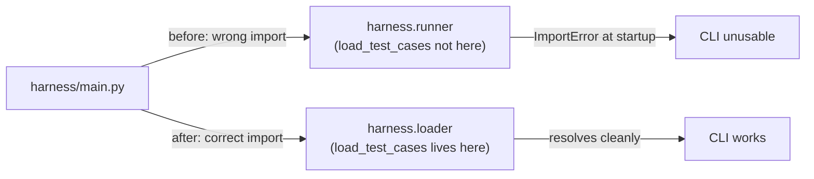

**Size: M**

## TW-11 — Write README and Part C answer

### One-line summary

Fixed a pre-existing import bug that prevented the CLI from starting at all, corrected the README with accurate CLI examples and new scoring/error-handling sections, and created `docs/part_c_investigation.md` covering three concrete RAG failure-investigation methods.

---

### Problem being solved

Two independent problems existed before this ticket:

1. **Silent CLI breakage.** `harness/main.py` imported `load_test_cases` from `harness.runner`, but that function lives in `harness.loader`. Any attempt to run `python -m harness.main` raised an `ImportError` at startup — the harness was completely un-runnable from the CLI entry point despite 43 passing unit tests.

2. **README gaps.** The documented CLI examples included a non-existent `harness run` subcommand and a `--endpoint` flag that does not exist. The "How scoring works" and "How errors are handled" sections were absent entirely, leaving a reviewer unable to understand or exercise the tool.

---

### Changes — file by file

| File | Change type | Detail |
|------|-------------|--------|
| `harness/main.py` | Bug fix | Changed `from harness.runner import load_test_cases` → `from harness.loader import load_test_cases` (single line) |
| `README.md` | Updated | Removed `harness run` subcommand; removed `--endpoint` flag; added full CLI options table; added "How scoring works" section; added "How errors are handled" section |
| `docs/part_c_investigation.md` | New | ~270-word RAG failure investigation covering index freshness, retrieval quality regression, and chunking/metadata filtering |

---

### Import fix — root cause


_Import was pointing at the runner module; the function is defined in the loader module._

---

### README additions — what was corrected

**CLI options table added:**

| Flag | Default | Description |
|------|---------|-------------|
| `<file>` | required | Path to `.jsonl` test-case file |
| `--scorer` | `keyword_overlap` | `exact_match` or `keyword_overlap` |
| `--mode` | `fixed` | Mock endpoint mode: `fixed`, `random`, `echo` |
| `--seed` | `42` | Random seed for reproducible runs |
| `--fail-rate` | `0.0` | Fraction of endpoint calls to simulate as failures (0–1) |
| `--output` | *(none)* | Path to write JSON report; omit to skip file output |

**Scoring section (key formula):** `keyword_overlap` computes Jaccard similarity over token sets after lowercasing and punctuation stripping. A case passes when `|intersection| / |union| >= 0.5`.

**Error handling section (exit codes):**

| Exit code | Meaning |
|-----------|---------|
| `0` | All cases ran (some may have failed scoring) |
| `1` | Input file missing or unreadable |
| `2` | All cases errored (no scoring possible) |

Per-case errors are captured in `TestResult.error` and do not stop the run. Anomalies (error rate > 20%, all responses identical) are flagged in stdout.

---

### Part C document — investigation approach

`docs/part_c_investigation.md` covers three root-cause areas for a RAG system returning wrong answers:

1. **Index freshness / version mismatch** — compare `indexed_at` vs `last_modified` timestamps in the document store (Weaviate / Qdrant / Pinecone). Stale chunks cause correct queries to return outdated content. Fix: trigger re-index on ingestion or schedule drift detection.

2. **Retrieval quality regression** — compute Recall@k and NDCG@k against a golden query set and compare to a deployment baseline. A drop signals that embedding model updates, index rebuilds, or query pre-processing changes have degraded retrieval. Fix: pin embedding model version; run golden-set eval on every rebuild.

3. **Chunking or metadata filtering issue** — run BM25 (Elasticsearch / `rank-bm25`) on the same queries without the vector index to check whether the source text is present at all. Audit metadata filters (date range, document type) for over-restriction that silently narrows the candidate pool.

---

### Risk and rollback

- **Import fix** is a one-line correction with no behavioural side-effects; the function signature and return type are unchanged.
- **README changes** are documentation only; no production code is affected.
- **`docs/part_c_investigation.md`** is a new file; deleting it restores the prior state.
- Rollback: revert commit `fca141e` — no database, no migration, no external state to clean up.

---

### Test evidence

```
43 passed in < 1s
```

CLI end-to-end smoke test (run after import fix):

```
python3 -m harness.main sample_data/normal_policy.jsonl --mode fixed

EVAL SUMMARY  total=5  passed=1  failed=4  errors=0  pass_rate=20.0%
```

The CLI was completely unrunnable before this fix. All 43 tests passed both before and after (tests import directly from `harness.loader`, so the broken `main.py` import did not affect them).
