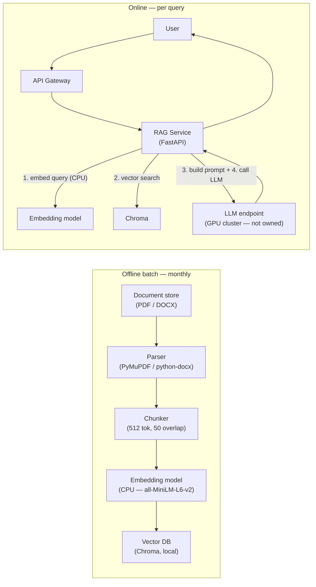

**Size: M**

## TW-6 — Part A System Design and Explicit Assumptions

### What was delivered

Two new documentation files committed in `feat/TW-6-part-a-system-design` (commit `24ec747`):

- `docs/part_a_system_design.md` — 98-line system design covering architecture, key decisions, monitoring, and one production failure mode
- `docs/assumptions.md` — 12 numbered assumptions (A1–A12) across four categories with an Assumption column and a Basis column citing the brief or reasoning

No code was changed. These files are the written deliverable for Part A of the take-home assignment.

---

### Architecture overview

The design describes a standard RAG pipeline split into two paths.

_Dual-path architecture: offline batch ingestion writes to Chroma; online query path reads from Chroma and calls the shared LLM endpoint via the internal API gateway._

**Components documented:**

| Component | Technology choice | Rationale |
|---|---|---|
| Parser | PyMuPDF / python-docx | CPU-only, no external dependencies, handles PDF + DOCX |
| Chunker | 512-token fixed-size, 50-token overlap | Simple, predictable, mitigates boundary-split failures |
| Embedding model | `all-MiniLM-L6-v2` (on-prem bundle) | ~30–50 ms per query on CPU; GPU reserved for LLM |
| Vector DB | Chroma (persistent local server) | Single-process, zero dedicated ops, sufficient for 2,000 docs |
| RAG service | FastAPI | Lightweight HTTP service, easy to deploy via Docker Compose or systemd |
| Query cache | In-memory LRU (or Redis for multi-replica) | Optional; effective for FAQ-style repeated queries across departments |

---

### Key decisions and tradeoffs (from `docs/part_a_system_design.md` §2)

| # | Decision | Alternative considered | Concrete tradeoff |
|---|---|---|---|
| 1 | Fixed-size chunking (512 tok, 50 overlap) | Semantic / document-aware chunking | Simpler, faster, predictable; retrieval quality slightly lower on structured docs — acceptable for v1 |
| 2 | Chroma | Weaviate / Qdrant / pgvector | Minimal ops; no horizontal scale needed at 2,000 docs / 20 users |
| 3 | CPU embedding | GPU embedding | ~30–50 ms per query is within 3 s budget; avoids GPU scheduling contention on shared cluster |
| 4 | No fine-tuning (chosen not to do) | Fine-tune LLM on internal docs | RAG achieves same grounding with lower cost and faster iteration; fine-tuning requires versioned training data + eval harness |
| 5 | No real-time indexing (chosen not to do) | Kafka → index on upload | Monthly batch frequency makes real-time infrastructure unnecessary complexity |
| 6 | No per-department ACL in v1 (chosen not to do) | Per-collection isolation per department | Deferred to v2; if needed, separate Chroma collections filtered by `department_id` at query time |

---

### Monitoring signals (from `docs/part_a_system_design.md` §3)

| Signal | Why it matters | How to collect |
|---|---|---|
| Query latency (p50 / p95 / p99), split by stage | Core SLA: p95 ≤ 3 s. Stage-level breakdown localises degradation to embed, retrieve, or LLM. | Prometheus histogram on the RAG service |
| LLM endpoint error rate and timeout rate | Shared GPU endpoint is the highest-risk dependency; timeouts cascade to users | HTTP client metrics + alerting |
| Retrieval top-K cosine score distribution | Low scores indicate out-of-distribution queries; alerts before answer quality visibly degrades | Log top-1 score per query; threshold alert |
| Vector DB index size | Detects runaway re-ingestion (duplicate chunks) and confirms ingestion completed | Chroma collection count metric |
| Batch job success / duration | Silent failures leave users querying stale data with no error signal | Exit code + duration logged to file or simple dashboard |
| User feedback (thumbs up / down) | Only ground-truth signal for answer quality; surfaces systematic failures invisible to latency metrics | In-app binary rating → append to log file |

---

### Production failure mode documented

**Stale embeddings during partial re-ingestion** — if the monthly batch job fails midway (OOM, disk full, timeout), the Chroma index is left in a mixed state: some documents at revision N+1, some still at N. A multi-document query retrieves chunks from different revision states, causing the LLM to synthesise a confident answer from contradictory context (e.g., two different annual-leave entitlements). No error is surfaced to the user or the system.

This failure is invisible in development because the dev pipeline always runs to completion on a small fixture dataset.

**Mitigation documented:** atomic-swap pattern — write new chunks to a staging collection, validate chunk count and score distribution against the previous collection, then atomically rename/alias. Expose collection version as a health endpoint.

---

### Assumptions (from `docs/assumptions.md`)

12 assumptions across four categories are explicitly stated:

- **Environment (A1–A3):** no internet at serving time; LLM endpoint pre-deployed on GPU cluster and not owned by this team; CPU is available for embedding without GPU contention
- **Documents (A4–A7):** PDF/DOCX format; English only; ~2,000 files (not pages); monthly batch refresh acceptable
- **Users and latency (A8–A10):** "snappy" = p95 ≤ 3 s end-to-end; 20 concurrent users ≈ 20–60 QPM at peak; shared single Chroma collection across departments (no ACL in v1)
- **Team and operations (A11–A12):** team owns and operates RAG service + vector DB; deployment target is Docker Compose or systemd (no Kubernetes assumed)

---

### Files changed

| File | Change type | Lines |
|---|---|---|
| `docs/part_a_system_design.md` | New | 98 |
| `docs/assumptions.md` | New | 36 |
