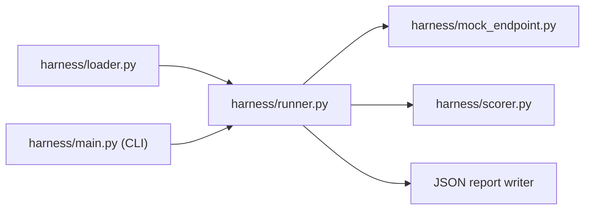

**Size: L**

## TW-9 — Build scoring and summary report

### One-line summary

Delivered the complete evaluation pipeline: JSONL loader, dual scorers (exact-match and keyword-overlap/Jaccard), mock endpoint with configurable failure modes, run orchestrator with per-case error isolation and anomaly detection, JSON report writer, and a CLI entry point — 6 production modules, 39 passing unit tests.

---

### Problem being solved

No evaluation infrastructure existed before this ticket. Test cases stored in JSONL had no path from file-on-disk to a scored result. The harness needed to: load and validate input, call an endpoint, compare the response against an expected answer, aggregate scores, detect operational anomalies, and emit a machine-readable report — all without a real LLM API key.

---

### Architecture — what was built

The evaluation pipeline is a linear composition of independent modules:


_Each module is independently importable; runner.py is the only integrator._

#### Scorer design — decision record

Two scorers were implemented. The ticket description recommended substring-containment; the plan comment noted Jaccard (keyword_overlap) is more robust.

| Option | Considered? | Verdict | Reason |
|--------|-------------|---------|--------|
| Substring-containment | Yes | Available as `exact_match` | Simple, fully deterministic |
| Jaccard keyword overlap | Yes | **Default (`keyword_overlap`)** | Handles phrasing variation; threshold 0.5 covers paraphrase |

Both scorers normalise text (lowercase, strip punctuation) before comparison. `exact_match` requires full normalised equality; `keyword_overlap` passes when the intersection/union of token sets >= 0.5.

#### Error isolation

`runner.py::run_evaluation()` wraps each endpoint call in a try/except. A per-case error is recorded in `TestResult.error` and does not stop the run. The final report counts errors separately from scored failures.

#### Anomaly detection

`runner.py::_detect_anomalies()` flags two conditions:

| Condition | Threshold | Flag message |
|-----------|-----------|--------------|
| Error rate | > 20% of cases | "high error rate: N/M cases errored" |
| Identical responses | All non-error responses equal | "all responses identical — endpoint may be returning a fixed stub" |

---

### File changes table

| File | Change type | Key additions |
|------|-------------|---------------|
| `harness/loader.py` | New | `TestCase` dataclass; `load_test_cases()` with invalid-JSON, missing-key, and empty-file guards |
| `harness/mock_endpoint.py` | New | `MockEndpoint` class; `random` / `fixed` / `echo` modes; configurable `fail_rate` (0-1) |
| `harness/scorer.py` | New | `Score` dataclass; `exact_match()` and `keyword_overlap()` scorers; `get_scorer()` factory |
| `harness/runner.py` | New | `TestResult` dataclass; `run_evaluation()`; `format_summary()` stdout reporter; `_detect_anomalies()` |
| `harness/main.py` | New | `argparse` CLI: `<file> [--scorer] [--mode] [--seed] [--fail-rate] [--output]` |
| `tests/test_scorer.py` | New | Scorer unit tests (exact_match, keyword_overlap, normalisation edge cases) |
| `tests/test_mock_endpoint.py` | New | Mode and fail_rate tests |
| `tests/test_loader.py` | New | Validation error path tests; empty-file guard |
| `tests/test_runner.py` | New | `run_evaluation()` integration tests; `format_summary()` output tests |

---

### Risk and rollback

- **Scorer threshold (0.5)** is a tunable constant in `scorer.py`. If downstream evaluation reveals too many false passes or false fails, adjust `THRESHOLD` in that file — no architectural change required.
- **Mock endpoint only.** No real LLM key is needed or used. Switching to a real endpoint requires replacing the endpoint callable passed to `run_evaluation()` — the runner interface accepts any `Callable[[str], str]`.
- **Rollback:** delete the `harness/` package and `tests/test_*.py` files. No database, no migration, no external state.

---

### Test evidence

```
39 passed in < 1s
```

Smoke-test run (5 cases, fixed mode, fail_rate=0):
```
EVAL SUMMARY  total=5  passed=1  failed=4  errors=0  pass_rate=20.0%

FAILURES / ERRORS:
  [q2] score=0.0000  score 0.00 < threshold 0.50; missing tokens: ['direct', 'manager']
  ...

ANOMALIES:
  all responses identical ('14 days annual leave') — endpoint may be returning a fixed stub
```

JSON report shape confirmed:
```json
{
  "total": 5, "passed": 1, "failed": 4, "errors": 0, "pass_rate": 0.2,
  "results": [
    {
      "id": "q1", "input": "...", "expected": "...", "response": "...",
      "passed": true, "score": 1.0, "method": "keyword_overlap",
      "reason": "keyword overlap sufficient", "error": null
    }
  ]
}
```
